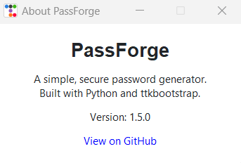

# 🔒 PassForge

A clean, lightweight, and secure **password generator** built with Python and ttkbootstrap.

---

## ✨ Features

- 🎛️ **Password Length Control**  
  Choose any password length up to **128 characters** (safe for most websites).
- 🔢 **Include Options**

  - Uppercase Letters (A-Z)
  - Numbers (0-9)
  - Symbols (!@# etc.)

- 🛡️ **Password Strength Meter**  
  Instantly see if your password is **Weak**, **Medium**, or **Strong**.

- 📋 **One-Click Copy to Clipboard**  
  Easily copy your generated password with a single button click.

- 📈 **Maximum Length Handling**  
  Warnings shown if you try to create passwords longer than 128 characters.

- 🖥️ **Polished Modern Interface**  
  Built using [ttkbootstrap](https://ttkbootstrap.readthedocs.io/) for a clean and responsive UI.

- 🧩 **About Page with GitHub Link**  
  Lightweight About popup with a clickable link to view source code.

- 🏹 **Window Auto-Centering**  
  Launches in the center of your screen for a professional look.

- 🛠️ **Executable Ready**  
  Can be built into a `.exe` using [PyInstaller](https://pyinstaller.org/) — no Python install needed to run!

---

## 📸 Screenshots

| Main Window              | About Window               |
| :----------------------- | :------------------------- |
|  |  |

---

## 🚀 How to Run

1. Clone this repository:
   ```bash
   git clone https://github.com/jimmysnetwork/PassForge.git
   cd PassForge
   ```
